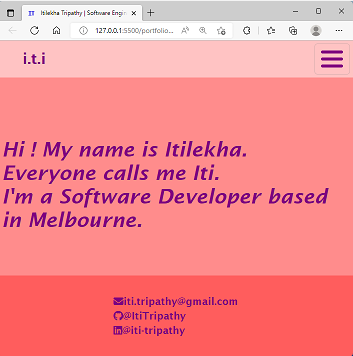

# My Portfolio WebPage

## Welcome to my portfolio web page!

My portfolio has the information about me, my skills, projects I've worked on and my contact information.

## Live Image

## MVP

-   You need to have it as a public repository on GitHub
-   In the repo you will also need a README.md with a short intro to the project.
-   You are to use SCSS for styling.
-   You are to use B.E.M as a naming convention.
-   !!! Responsiveness is vital – use Grid, Flex, whatever you wish but the site must look good at all screen widths. VERY CRITICAL! : You will need to make sure that your website looks good on phones, tablets and laptops (we will see Media Queries next week, docs to follow)

### Your Portfolio should have the following section:

-   A landing page/section with your name and title on it.
-   An About page/section with a little bit about you
-   A Tech stacks/skills page/section with all the techs you have learned during the course
-   A Project page/section with all your projects (use placeholder images and text at the beginning to render your website as it would with actual projects) - each project should have a little description, a link to a live version and a link to the matching GitHub Repo (using a README.md at the root of the repo to include how you went about coding for that project)
-   A Contact page/section with your email, GitHub profile link, LinkedIn profile link

## Setup

-   Install VS Code for development
-   GitHub setup for adding the project to the repository : Important Commands :

    -   git remote add origin git@github.com:ItiTripathy/portfolio-website.git
    -   git add .
    -   git commit -m "Comment"
    -   git push origin main

-   Install and run SCSS settings : Important Command [sass --watch --no-source-map style.scss style.css ]

-   FontAwesome setup : Add the following to the files , "
    script src="https://kit.fontawesome.com/4cce38de96.js"
    crossorigin="anonymous" >"

## Implementation

### My Portfolio has the following pages:

-   home.html (This has my Name and a small introduction)
-   about.html (This has my profile picture and some detailed info about me)
-   skills.html (This lists all of my technical skills)
-   projects.html (This currently has placeholders for all the future projects which will be updated with appropriate information later on)
-   The contact information is in the footer section (gmail, github & linkedin)
-   script.js (Javascript code for the Hamburger menu style)

### This webpage has been designed using SCSS and follows the BEM convention and uses a clean color palette.

### The responsiveness for different media devices is handled by using the media queries.

## Known Issues

## Things I'd differently next time

-   I would redesign the website to be a single page application

## Future goals / changes

-   Implement the website using React, single page application approach.

## Issues/Roadblocks faced

-   Designing the look & feel and color palette of the website. Deciding when to stop designing.

## Contribution

-   Favicon was designed using the website : https://www.favicon.cc/
